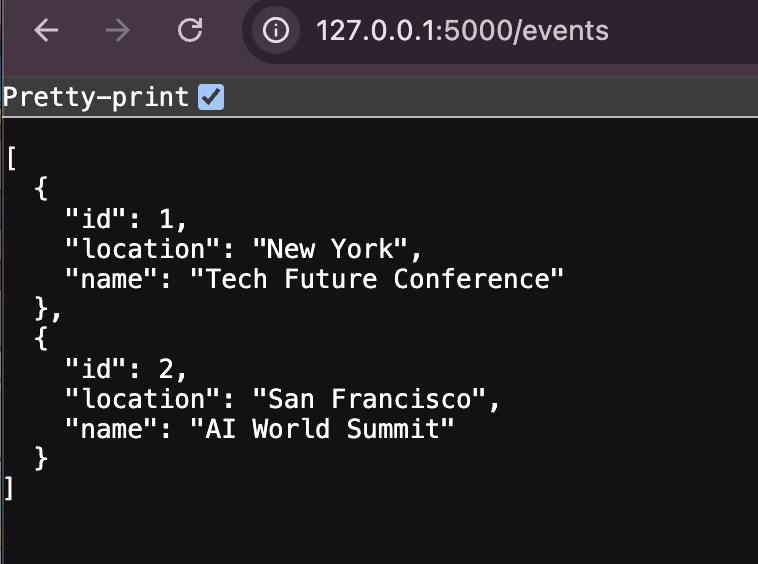

# Lab: Flask SQLAlchemy Relationships

A Flask-SQLAlchemy app for an event management company (EventWise) which sets up one-to-one, one-to-many, and many-to-many relationships. Created Event, Session, Speaker, and Bio models, ran migrations, seeded data, and built API endpoints to fetch related data.

## Table of Contents

- [Demo](#demo)
- [Setup](#setup)
- [Testing](#testing)
- [Features](#features)
- [Endpoints](#endpoints)

## Demo



## Setup

1. Fork & clone the repo

2. Install dependencies and enter the virtualenv:
   ```bash
   pipenv install
   pipenv shell
   ```
3. Configure Flask and run migrations:
   ```bash
   cd server
   export FLASK_APP=app.py
   export FLASK_RUN_PORT=5555
   flask db init   
   flask db migrate -m "Create relationships"
   flask db upgrade
   ```
4. Seed the database:
   ```bash
   python seed.py
   ```
5. Start the server:
   ```bash
   flask run
   ```

## Testing

run on your terminal:

```bash
pytest
```

## Features

- **Models & Relationships**: Event⇨Sessions (1-to-M), Speaker⇨Bio (1-to-1), Session⇆Speaker (M-to-M)
- **Migrations**: Created with Flask-Migrate (Alembic)
- **Seed Script**: Populates sample Events, Sessions, Speakers, and Bios
- **API Endpoints**: Easily fetch events, sessions, speakers, and relationships
- **Error Handling**: Returns 404 JSON responses for missing resources

## Endpoints

### GET `/events`

- Returns all events

### GET `/events/<id>/sessions`

- Returns sessions for an event or 404

### GET `/speakers`

- Returns all speakers

### GET `/speakers/<id>`

- Returns a speaker with bio or 404


### GET `/sessions/<id>/speakers`

- Returns speakers for a session or 404
